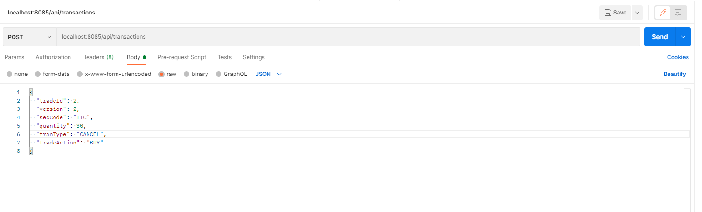
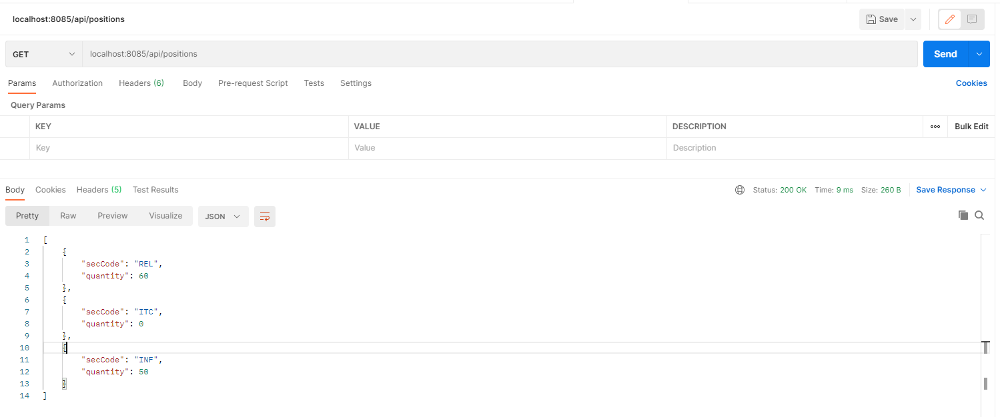
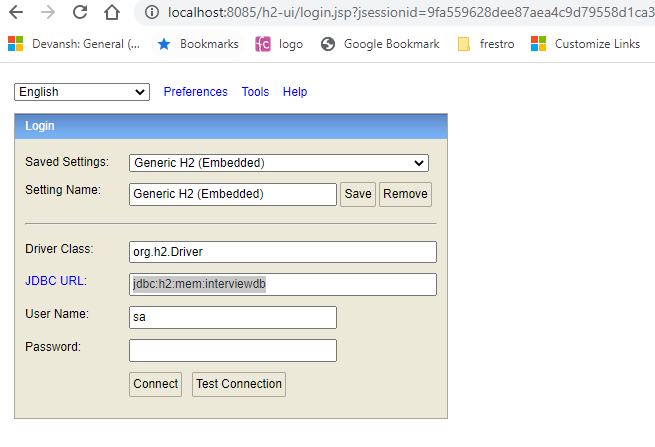

<!-- ABOUT THE PROJECT -->
## position-browser

This code based on Transaction activity calculates and updates the latest position for securities


### Built With


* Spring Boot
* Spring Data JPA
* H2 in memory DB
* lombok

<p align="right">(<a href="#top">back to top</a>)</p>

<!-- GETTING STARTED -->
## Getting Started

Build cmd 
 - mvn clean install
Run cmd
 - mvn spring-boot:run

* Running port = 8085



Input data -(Single transaction supported at thi moment)

POST url - http://localhost:8085/api/transactions 

{
"tradeId": 1,
"version": 1,
"secCode": "REL",
"quantity": 50,
"tranType": "INSERT",
"tradeAction": "BUY"
}


{
"tradeId": 2,
"version": 1,
"secCode": "ITC",
"quantity": 40,
"tranType": "INSERT",
"tradeAction": "SELL"
}

{
"tradeId": 3,
"version": 1,
"secCode": "INF",
"quantity": 70,
"tranType": "INSERT",
"tradeAction": "BUY"
}

{
"tradeId": 1,
"version": 2,
"secCode": "REL",
"quantity": 60,
"tranType": "UPDATE",
"tradeAction": "BUY"
}

{
"tradeId": 2,
"version": 2,
"secCode": "ITC",
"quantity": 30,
"tranType": "CANCEL",
"tradeAction": "BUY"
}

{
"tradeId": 4,
"version": 1,
"secCode": "INF",
"quantity": 20,
"tranType": "INSERT",
"tradeAction": "SELL"
}

OUTPUT url - `http://localhost:8085/api/positions




In memory H2 console url - http://localhost:8085/h2-ui
JDBC URL - `jdbc:h2:mem:interviewdb`



### Prerequisites

This is an example of how to list things you need to use the software and how to install them.
* JDK 11

### Installation


1. Clone the repo
   ```sh
   git clone https://github.com/kunalshinde098/position-browser.git
   ```

<p align="right">(<a href="#top">back to top</a>)</p>


